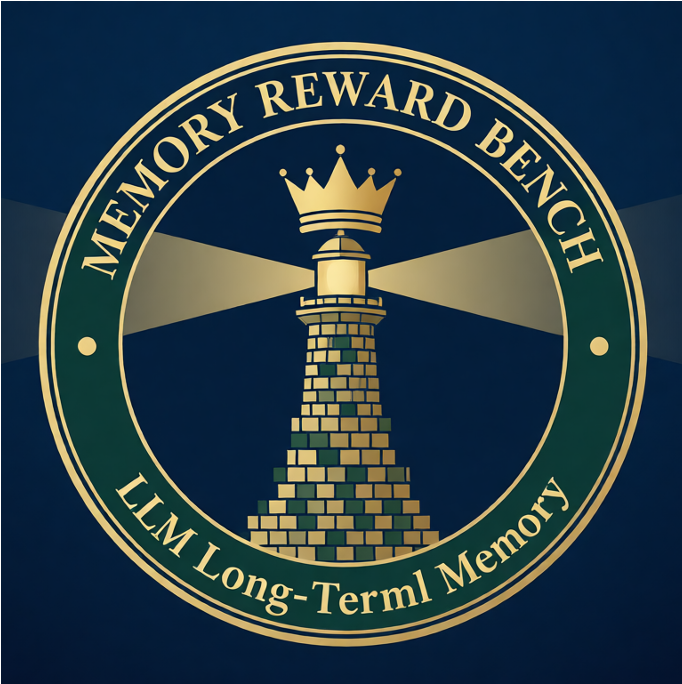

#  MemRewardBench

<p align="center">
    <a href="https://arxiv.org/pdf/2601.11969"></a>
    <a href="https://huggingface.co/datasets/LCM-Lab/MemRewardBench"></a>
    <a href="https://opensource.org/licenses/Apache-2.0"></a>
</p>

> *The first benchmark to systematically evaluate Reward Models' ability to assess long-term memory management in LLMs across contexts up to 128K tokens.*

---

## Introduction

**MemRewardBench** is the first dedicated benchmark for evaluating **Reward Models (RMs)** in their ability to judge long-term memory management processes in Large Language Models. Unlike existing benchmarks that evaluate LLMs directly, MemRewardBench focuses on assessing how well RMs can evaluate the quality of intermediate memory states and memory management trajectories.

The benchmark includes **2,400 high-quality samples** across **three core tasks**: **Long-context Reasoning**, **Multi-turn Dialogue Understanding**, and **Long-form Generation**, with context lengths ranging from **8K to 128K tokens**. Each sample provides:
- A question with long context
- Two memory management trajectories (chosen and rejected)
- Ground-truth judgments based on both outcome correctness and process quality

---

## How to Use

### Loading Data

You can download and load MemRewardBench data through Hugging Face datasets:
```python
from datasets import load_dataset

# Load specific task
data = load_dataset('LCM-Lab/MemRewardBench', 'Long-context_Reasoning', split='train')

# Or load all tasks
tasks = ['Long-context_Reasoning', 'Multi-turn_Dialogue_Understanding', 'Long-form_Generation']
for task in tasks:
    data = load_dataset('LCM-Lab/MemRewardBench', task, split='train')
```

Alternatively, download the entire dataset using huggingface-cli:
```bash
huggingface-cli download \
  --repo-type dataset \
  --resume-download \
  LCM-Lab/MemRewardBench \
  --local-dir ./data
```

---

### Data Format

All data in MemRewardBench are standardized to the following format:
```json
{
    "task": "Task category (Long-context_Reasoning, Multi-turn_Dialogue, Long-form_Generation)",
    "chosen": "Higher-quality memory management trajectory with better intermediate states",
    "rejected": "Lower-quality memory management trajectory with suboptimal memory updates",
    "subtask": "Specific setting (e.g., 'Sequential-Noise', 'Parallel', 'Mem0-Out')",
    "ctx_length": "Context length in tokens (8k, 16k, 32k, 64k, or 128k)",
    "question": "The evaluation question along with the full context"
}
```

**Field Descriptions**:
- **task**: Broad task category covering the three main evaluation scenarios
- **chosen**: Memory trajectory that demonstrates superior memory management (more concise, accurate, and logically coherent)
- **rejected**: Memory trajectory with issues like redundant information, dropped critical details, or delayed updates
- **subtask**: Specific memory management pattern and error type (e.g., Sequential-Noise, Mixed-Drop, A-Mem-Mem)
- **ctx_length**: Token-based context length, testing RM capability across different sequence lengths
- **question**: Complete input including the question and long context for evaluation

---

## Evaluation

### 1. Clone and Install
```bash
git clone https://github.com/LCM-Lab/loomeval
cd loomeval
pip install -e .
```

### 2. Run Evaluation
```bash
loomeval.run \ 
  --model_path /path/to/model \
  --cfg_path /benchmarks/Reward/MemRewardBench/configs/MemRewardBench.yaml \
  --server vllm \
  --device 0 1 2 3 4 5 6 7 \
  --gp_num 1 \
  --output_dir /path/to/results \

```

**Key Arguments**:
- `--model_path`: (Required) HuggingFace model path or API model name
- `--cfg_path:` (Required) Path to the benchmark configuration file
- `--output_dir:` (Optional) Results output directory (default: auto-generated path)
- `--device:` GPU IDs to use for open-source models (default: all available GPUs)
- `--gp_num:` Number of GPUs allocated per task instance
- `--server:` Backend inference framework to use for model execution


---

## Benchmark Statistics

| Task Type | Settings | Context Length Distribution | Total |
|-----------|----------|----------------------------|-------|
| | | 8k / 16k / 32k / 64k / 128k | |
| **Long-context Reasoning** | Sequential-Noise | 101 / 44 / 43 / 36 / 31 | 255 |
| | Sequential-Drop | 35 / 22 / 22 / 40 / 15 | 134 |
| | Mixed-Noise | 22 / 33 / 49 / 46 / 34 | 184 |
| | Mixed-Drop | 19 / 65 / 72 / 43 / 28 | 227 |
| **Multi-turn Dialogue** | Mem0-Out | 27 / 27 / 42 / 48 / 23 | 167 |
| | Mem0-Mem | 25 / 25 / 41 / 47 / 21 | 159 |
| | A-Mem-Out | 42 / 42 / 48 / 50 / 47 | 229 |
| | A-Mem-Mem | 48 / 45 / 49 / 53 / 50 | 245 |
| **Long-form Generation** | Sequential | 49 / 152 / 147 / 67 / 42 | 457 |
| | Parallel | 51 / 48 / 53 / 133 / 58 | 343 |
| **Total** | 10 settings | 419 / 503 / 566 / 563 / 349 | **2,400** |

---


## 📬 Contact

If you have any questions, plz check out at: `iiiigray19@gmail.com` or `zecheng.tang@foxmail.com`.

---

## Citation

If you find our work helpful, please cite:

```bibtex
@article{tang2026memoryrewardbench,
  title={MemoryRewardBench: Benchmarking Reward Models for Long-Term Memory Management in Large Language Models},
  author={Tang, Zecheng and Ji, Baibei and Sun, Ruoxi and Wang, Haitian and You, WangJie and Yijun, Zhang and Zhu, Wenpeng and Qi, Ji and Li, Juntao and Zhang, Min},
  journal={arXiv preprint arXiv:2601.11969},
  year={2026}
}
```

---

## License
This benchmark is released under the Apache-2.0 License.
